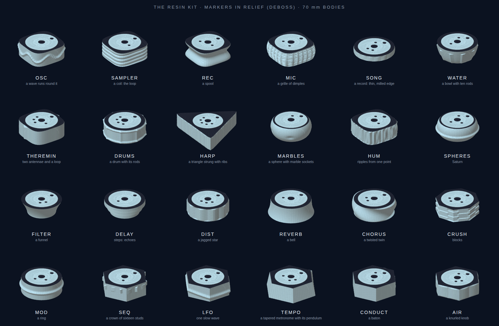
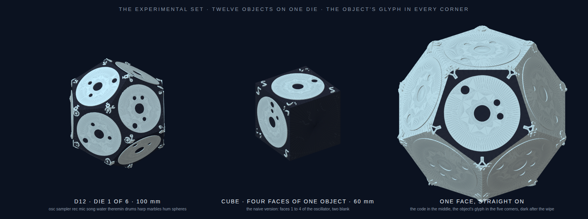

# Lumatable printed kit

Everything in this folder is generated: run `python3 make_parts.py` to rebuild the
meshes (and `render_preview.py` for the picture), and the two marker sheets and the cards come straight out of the instrument
(`markers` in the header, or the `markerSheetHTML()` / `cardsHTML()` functions in
`prototype/index.html`).

## Parts (`print/`)

| File | What it is | Marker |
|---|---|---|
| `cube-60.stl` / `.obj` | 60 mm cube, a 53 mm × 0.8 mm circular pocket on all six faces | 52 mm discs from `markers-52mm.html` |
| `puck-70-round.stl` / `.obj` | 70 mm round puck, 18 mm tall, marker pocket on top, 60 mm felt pocket underneath | 60 mm discs from `markers-60mm.html` (trim to 52 mm for the pocket, or print the 52 mm sheet) |
| `puck-70-hex.stl` / `.obj` | 70 mm across-flats hexagonal puck, same pockets: the advanced set | as above |

All meshes are closed and watertight (the generator checks every edge is shared by
exactly two triangles) and are in millimetres with Z up, so they drop straight into
Cura, PrusaSlicer or Bambu Studio.

**Which shape for which object.** The table does not care: the marker disc decides
what an object is. The shapes are for hands and eyes:

- **Cubes** for anything with faces worth flipping: oscillators (four waveforms),
  sequencers (patterns A–D), filters, loops, and the scene puck (snapshots A–D). Stick
  four faces of one object on four sides and leave two blank (a blank face up means
  "off the table").
- **Round pucks** for the things you only turn: tempo, key, tuning, space, master,
  stems, rec, mic, the effects.
- **Hex pucks** for the advanced modifiers, so they read as a different family on the
  table, matching their hexagonal outline on screen: envelope, express, steps, euclid,
  chance, chain, motion, warp, send.
- **The play tray** (theremin, air drums, harp, marbles, hum, conductor, air knob) has its
  own section on the marker sheets. Cubes suit the ones with four faces (drums, harp,
  marbles, hum); round pucks suit the theremin and the conductor. Their pads, strings and
  fields are drawn on the screen around the object, so leave space around them.

## The resin kit: sculpted bodies, markers in relief (`print/kit/`)

`make_kit.py` makes a second kit for a resin printer. Nothing is stuck on: the marker is
**two levels of relief, 0.6 mm apart**, on the flat top of every body, so one wipe of paint
colours the code. The rest of the body is sculpted so that a hand or an eye can tell what
it is without reading anything.

**Two relief schemes**, pick the one that suits how you paint:

- **deboss** (default, `print/kit/*.stl`): the disc field stands proud; the id dots and the
  ring around the disc are sunk. Print in a light resin. Flood the top with dark acrylic
  (or a wash), let it settle, wipe the top flat with a cloth: paint stays in the pits, the
  field wipes clean. Crisp, and forgiving of a shaky hand.
- **emboss** (`python3 make_kit.py --relief emboss`, one example in `print/kit-emboss/`):
  the dots and the outer ring stand proud, the field is sunk. Roll or dab dark paint over
  the top with a foam pad: it touches only the raised parts. Or print in a dark resin and
  roll the field white? No: the field is the sunk part, so with emboss the raised code is
  what takes the paint. Use deboss if you print dark and want to fill the code light.

Either way the camera sees what the sticker gave it: a light disc, dark dots, a dark ring
around. The ring is what the detector measures the disc against, so do not leave the area
outside the disc the same colour as the field.

**The bodies.** 70 mm across the top (64 mm for the square family), 22 to 30 mm tall, a
flat top for the marker, a flat bottom with a 60 mm felt pocket, and sculpted sides:

| family (on screen) | plan | bodies |
|---|---|---|
| yellow, makes sound | rounded square | **osc** a wave runs round it · **sampler** a coil · **rec** a spool · **mic** a barrel with a grille of dimples · **hum** ripples spreading from one point · **theremin** two antennae and a loop · **harp** a triangle strung with ribs · **drums** a drum with its rim and rods · **marbles** a sphere with sockets · **water** a bowl with ten rods · **spheres** Saturn · **song** a thin record with a milled edge |
| green, changes sound | round | **filter** a funnel · **delay** three steps · **dist** a jagged star · **reverb** a bell · **chorus** a twisted twin · **crush** blocks · **mod** a ring |
| purple, bosses | hexagon | **seq** a crown of sixteen studs · **lfo** one slow wave · **tempo** a tapered metronome with its pendulum · **conduct** a baton · **air** a knurled knob |

So the three colours of the screen become three plan shapes under the hand, and each
object has its own silhouette on top of that. The advanced set stays hexagonal and plain
(`--hex key`, `--hex tune`, …): it is the grown-ups' set and lives on its cards.

**Faces.** A sculpted body carries one marker (face 1 of its object). Faces are flipped
on screen with a tap, as always. If you want physical faces, the cube is still here with
the code in relief: `python3 make_kit.py --cube osc` makes a 60 mm cube with faces 1 to 4
of the oscillator on four sides and two blank sides (`print/kit/cube-60-osc.stl` is the
example). `--round rec` makes a plain round puck for any object.

**Resin notes.**

- Hollow the bodies in the slicer (2.5 mm walls, two 3 mm drain holes in the bottom
  pocket) or they cost 90 to 125 cm³ of resin each. The cube is 220 cm³ solid: hollow it.
- Print the bodies top-down on the plate, or tilted 20° with supports on the bottom
  only: the marker top must come out clean, with no support marks. Nothing overhangs
  except the bell, the ring, Saturn and the spool waist, which self-support at these
  angles.
- 0.05 mm layers show the wave and the coil best; 0.1 mm is fine for the rest.
- Wash, cure, then paint the code. Matte varnish over the top kills reflections, which
  the camera likes.

**Regenerate.** `python3 make_kit.py` writes the 24 bodies; `--only osc,mic` a few;
`--obj` for OBJ files as well; `--out` elsewhere. `python3 render_kit.py` draws the
picture above (an SVG; a browser turns it into `kit.png`). Every mesh is checked closed and
watertight before it is written, and the ids are read out of the instrument so they stay in
step with the marker sheets.

## The experimental set: twelve objects on one die (`print/kit-faces/`)

One sculpted body per object is the clearest kit, and the largest: twenty-four bodies. The
experimental set puts **twelve objects on one body**: a regular dodecahedron, 100 mm between
opposite faces, with a 54 mm marker in relief on every face. Opposite faces are parallel, so
whichever face is down, the face on top is flat to the camera. Because the sides are other
faces, the object's identity moves into the corners: **the object's glyph, in relief, in all
five corners** of its face (a wave, a coil, a spool, a mic, a funnel, three bars, a zigzag, a
bell, two circles, a crown of dashes…), so a face reads from any side and needs no words.
The glyphs rise to the field level, so the same wipe that colours the code leaves them light
on the dark ring. `tests/faces.test.js` checks that the detector still reads every id with
the glyphs there, down to 0.8 pixels per millimetre.

- `d12-set-1.stl`: osc, sampler, rec, mic, song, water, theremin, drums, harp, marbles, hum, spheres
- `d12-set-4.stl`: filter, delay, dist, reverb, chorus, crush, mod, seq, lfo, tempo, conduct, air

Those two dice hold the whole kit once. `python3 make_kit.py --d12-set` makes all six: die k
carries twelve consecutive objects starting four along from the die before, so every object
sits on three dice and a table of six dice can show most combinations you would want at
once. `--d12 osc,filter,seq,…` makes a die with your own twelve. Faces left unnamed are blank.

How many bodies you need is set by how many objects sit on the table at once (six to eight),
not by how many objects exist; the dice decide how often the one you want is already in your
hand. The naive version, the Reactable's cube, is here too, now with the glyphs in its four
corners: `--cube osc` gives faces 1 to 4 of one object and two blanks (`print/kit/cube-60-osc.stl`).

Trade-offs, honestly: a 100 mm die is a handful for a child, and twelve flat faces roll more
readily than a puck when nudged. Hollow it to 3 mm walls (about 125 cm³ of resin) and it is
light enough; a felt dot in the middle of each face stops the sliding. The 60 mm cube is
steadier and cheaper (65 cm³ hollowed) but holds six faces, not twelve.

## Print settings

- 0.2 mm layers, 15–20 % infill, 3 walls, any PLA or PETG. No supports: the pockets
  face up or down and the sides are vertical.
- Print the cube on any face; the top pocket is 0.8 mm deep and prints cleanly as a
  bridge-free recess. The first-layer pocket on the bottom face benefits from a
  slightly slower first layer.
- A matte, light-coloured filament hides fingerprints; the marker is the only thing
  the camera reads, so colour is free.
- Cube: ~205 cm³ envelope, about 45 g at 15 % infill and 2 h 30 at 0.2 mm. Pucks:
  ~20 g, 50 min each.

## Assembly

1. Print the marker sheet at **100 %, no scaling** on matte white card (the 52 mm sheet
   for the cube pockets, either sheet for the pucks).
2. Cut each disc with a 1 mm white margin and press it into its pocket with a dot of
   glue stick. The pocket keeps the disc flat and centred, which is what the detector
   wants.
3. Stick a felt pad in the pocket underneath each puck so it slides on the screen
   without scratching it.
4. Keep the heading dot pointing the same way on every face of a cube: turning the cube
   then feels the same whichever face is up.

## Camera notes

The detector reads a white disc with black dots: a 3 mm heading dot at 0.38 D from
the centre and up to eight 2.3 mm ID dots on a ring at 0.24 D (45° apart, 256 ids).
On a 55" TV filmed at 1280 × 720 that is roughly one pixel per millimetre, so a 52 mm
disc is 52 px across and each ID dot about 2.5 px: enough, but with little margin. If
detection is flaky, film at 1080p, add light from the side (not above, to avoid a
reflection of the lamp in the screen), or use the 60 mm sheet on the pucks.

Lifting a cube toward the camera makes its marker larger; the instrument reads that as
pressure (see docs/07-advanced.md, *lift and tilt*). Tilting a cube squashes the disc
into an ellipse, read as a pitch bend. Both need the marker to stay in frame and
roughly in focus, which a phone's autofocus handles at the usual 50–70 cm.
