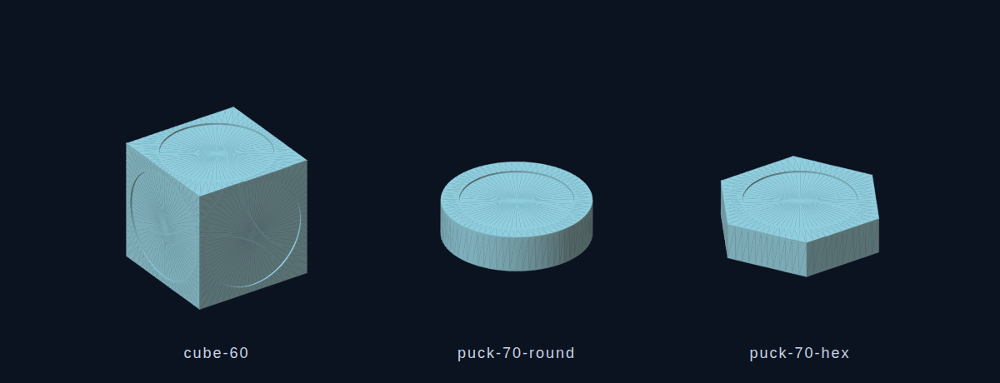

# Lumatable printed kit

Everything in this folder is generated: run `python3 make_parts.py` to rebuild the
meshes (and `render_preview.py` for the picture), and the two marker sheets and the cards come straight out of the instrument
(`markers` in the header, or the `markerSheetHTML()` / `cardsHTML()` functions in
`prototype/index.html`).

## Parts (`print/`)

| File | What it is | Marker |
|---|---|---|
| `cube-60.stl` / `.obj` | 60 mm cube, a 53 mm × 0.8 mm circular pocket on all six faces | 52 mm discs from `markers-52mm.html` |
| `puck-70-round.stl` / `.obj` | 70 mm round puck, 18 mm tall, marker pocket on top, 60 mm felt pocket underneath | 60 mm discs from `markers-60mm.html` (trim to 52 mm for the pocket, or print the 52 mm sheet) |
| `puck-70-hex.stl` / `.obj` | 70 mm across-flats hexagonal puck, same pockets: the advanced set | as above |

All meshes are closed and watertight (the generator checks every edge is shared by
exactly two triangles) and are in millimetres with Z up, so they drop straight into
Cura, PrusaSlicer or Bambu Studio.

**Which shape for which object.** The table does not care: the marker disc decides
what an object is. The shapes are for hands and eyes:

- **Cubes** for anything with faces worth flipping: oscillators (four waveforms),
  sequencers (patterns A–D), filters, loops, and the scene puck (snapshots A–D). Stick
  four faces of one object on four sides and leave two blank (a blank face up means
  "off the table").
- **Round pucks** for the things you only turn: tempo, key, tuning, space, master,
  stems, rec, mic, the effects.
- **Hex pucks** for the advanced modifiers, so they read as a different family on the
  table, matching their hexagonal outline on screen: envelope, express, steps, euclid,
  chance, chain, motion, warp, send.
- **The play tray** (theremin, air drums, harp, marbles, hum, conductor, air knob) has its
  own section on the marker sheets. Cubes suit the ones with four faces (drums, harp,
  marbles, hum); round pucks suit the theremin and the conductor. Their pads, strings and
  fields are drawn on the screen around the object, so leave space around them.

## Print settings

- 0.2 mm layers, 15–20 % infill, 3 walls, any PLA or PETG. No supports: the pockets
  face up or down and the sides are vertical.
- Print the cube on any face; the top pocket is 0.8 mm deep and prints cleanly as a
  bridge-free recess. The first-layer pocket on the bottom face benefits from a
  slightly slower first layer.
- A matte, light-coloured filament hides fingerprints; the marker is the only thing
  the camera reads, so colour is free.
- Cube: ~205 cm³ envelope, about 45 g at 15 % infill and 2 h 30 at 0.2 mm. Pucks:
  ~20 g, 50 min each.

## Assembly

1. Print the marker sheet at **100 %, no scaling** on matte white card (the 52 mm sheet
   for the cube pockets, either sheet for the pucks).
2. Cut each disc with a 1 mm white margin and press it into its pocket with a dot of
   glue stick. The pocket keeps the disc flat and centred, which is what the detector
   wants.
3. Stick a felt pad in the pocket underneath each puck so it slides on the screen
   without scratching it.
4. Keep the heading dot pointing the same way on every face of a cube: turning the cube
   then feels the same whichever face is up.

## Camera notes

The detector reads a white disc with black dots: a 3 mm heading dot at 0.38 D from
the centre and up to eight 2.3 mm ID dots on a ring at 0.24 D (45° apart, 256 ids).
On a 55" TV filmed at 1280 × 720 that is roughly one pixel per millimetre, so a 52 mm
disc is 52 px across and each ID dot about 2.5 px: enough, but with little margin. If
detection is flaky, film at 1080p, add light from the side (not above, to avoid a
reflection of the lamp in the screen), or use the 60 mm sheet on the pucks.

Lifting a cube toward the camera makes its marker larger; the instrument reads that as
pressure (see docs/07-advanced.md, *lift and tilt*). Tilting a cube squashes the disc
into an ellipse, read as a pitch bend. Both need the marker to stay in frame and
roughly in focus, which a phone's autofocus handles at the usual 50–70 cm.
